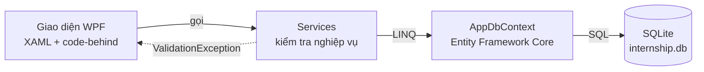

# Hệ thống quản lý thực tập sinh

Bài tập lớn học phần **Công nghệ .NET (CSE703009)**, Đại học Phenikaa.
Ứng dụng desktop **WPF** trên **.NET Framework 4.7.2**, CSDL **SQLite**, truy cập dữ liệu bằng **Entity Framework Core**.

## 1. Chạy chương trình

Yêu cầu: Windows 10, Visual Studio 2022 có workload **.NET desktop development**. Lần build đầu cần Internet để tải gói NuGet.

1. Mở `InternManagement.sln` bằng Visual Studio.
2. Chuột phải `InternManagement.Wpf` → **Set as Startup Project**.
3. Nhấn **F5**. Lần chạy đầu tiên tự tạo file `internship.db` cạnh file `.exe` và nạp dữ liệu mẫu.

Muốn làm lại dữ liệu từ đầu: xóa file `internship.db` trong `src/InternManagement.Wpf/bin/Debug/net472/` rồi chạy lại.

### Tài khoản mẫu

| Vai trò | Tên đăng nhập | Mật khẩu |
|---|---|---|
| Quản trị viên | `admin` | `admin123` |
| Mentor | `an@congty.vn`, `binh@congty.vn`, `cuong@congty.vn` | `123456` |
| Thực tập sinh | `TTS001` … `TTS006` | `123456` |

Khi thêm mentor/thực tập sinh mới, hệ thống tự tạo tài khoản: mentor đăng nhập bằng **email**, thực tập sinh bằng **mã TTS**, mật khẩu mặc định `123456`.

## 2. Chức năng theo vai trò

| Chức năng | Admin | Mentor | Thực tập sinh |
|---|:-:|:-:|:-:|
| Tổng quan (Dashboard, biểu đồ) | ✔ | | |
| Sơ đồ tổ chức (TreeView) | ✔ | | |
| Quản lý phòng ban | ✔ | | |
| Quản lý mentor | ✔ | | |
| Quản lý thực tập sinh, lọc, xuất CSV | ✔ | Xem TTS của mình | |
| Giao việc | ✔ | TTS của mình | |
| Đánh giá | Xem | TTS của mình | |
| Xem việc được giao, cập nhật tiến độ, xem đánh giá | | | ✔ |
| Đổi mật khẩu, đăng xuất | ✔ | ✔ | ✔ |

### Quy tắc nghiệp vụ (kiểm tra trong tầng Service)

- Mã TTS, email thực tập sinh, email mentor, tên phòng ban, tên đăng nhập: **không trùng**.
- Email đúng định dạng; số điện thoại (nếu nhập) gồm 10 chữ số, bắt đầu bằng 0.
- Ngày kết thúc thực tập phải **sau** ngày bắt đầu; hạn công việc không trước ngày giao.
- Mentor của thực tập sinh phải **cùng phòng ban**.
- Không xóa phòng ban còn mentor/TTS; không xóa mentor còn hướng dẫn TTS hoặc đã có phiếu đánh giá.
- Xóa thực tập sinh thì xóa luôn công việc, đánh giá và tài khoản (cascade).
- Chỉ **mentor đang hướng dẫn** mới được đánh giá TTS đó; điểm thành phần trong khoảng 0–10.
- Thực tập sinh chỉ được cập nhật trạng thái công việc **của mình**.
- Công việc **quá hạn** = chưa hoàn thành và đã qua hạn chót (tô đỏ trên bảng).
- Xếp loại theo điểm TB: ≥ 8.5 Giỏi, ≥ 7 Khá, ≥ 5 Trung bình, còn lại Yếu.
- Mật khẩu được **băm PBKDF2 + salt**, CSDL không lưu mật khẩu gốc.

## 3. Kiến trúc

```
InternManagement.sln
├── src/InternManagement.Core/        Thư viện nghiệp vụ (netstandard2.0)
│   ├── Models/        Lớp dữ liệu: Person (lớp cha) → Mentor, Intern; Department, User, TaskItem, Evaluation
│   ├── Data/          AppDbContext (EF Core + SQLite), DbSeeder (tạo CSDL + dữ liệu mẫu)
│   ├── Services/      Nghiệp vụ: Auth, Department, Mentor, Intern, Task, Evaluation, Dashboard
│   ├── Helpers/       PasswordHasher, Validator, CsvExporter, StatusText
│   └── Exceptions/    ValidationException (lỗi nhập liệu / nghiệp vụ)
├── src/InternManagement.Wpf/         Ứng dụng WPF (.NET Framework 4.7.2)
│   ├── App.xaml       Tài nguyên dùng chung: màu, Style, Trigger, Converter
│   ├── LoginWindow    Đăng nhập
│   ├── MainWindow     Menu + ToolBar + StatusBar, chuyển trang theo vai trò
│   ├── Views/         Các trang (UserControl) và cửa sổ Thêm/Sửa (Window)
│   ├── AppServices.cs Khởi tạo CSDL và các service
│   └── Session.cs     Tài khoản đang đăng nhập
└── tests/InternManagement.Core.Tests/ Kiểm thử tự động cho tầng Core (xUnit)
```



Luồng một thao tác (ví dụ thêm thực tập sinh):
1. `InternEditWindow` có `DataContext` là một đối tượng `Intern`; các ô nhập **Binding hai chiều** vào thuộc tính.
2. Bấm **Lưu** → `AppServices.Interns.Add(intern)`.
3. `InternService` kiểm tra dữ liệu (`Validator`, trùng mã/email, mentor cùng phòng ban…). Sai → ném `ValidationException`, giao diện bắt và hiện `MessageBox`.
4. Hợp lệ → thêm `Intern` + `User` vào `AppDbContext`, `SaveChanges()` sinh câu lệnh `INSERT`.
5. Cửa sổ đóng với `DialogResult = true`, danh sách gọi lại `LoadData()`.

### Vì sao chọn EF Core 3.1?

Đề cương yêu cầu .NET Framework + SQLite + Entity Framework. EF6 không hỗ trợ tự tạo bảng trên SQLite (phải viết script SQL tay); **EF Core 3.1 là bản EF Core cuối cùng chạy được trên .NET Framework** và tạo bảng tự động bằng `EnsureCreated()`.

### Vì sao tách project Core?

Tách giao diện khỏi nghiệp vụ: Service không biết gì về WPF nên kiểm thử tự động được (`tests/`), và có thể thay giao diện khác mà không sửa nghiệp vụ.

## 4. Đối chiếu đề cương học phần

| Nội dung đề cương | Thể hiện trong đồ án |
|---|---|
| 2.8–2.9 Phương thức, lớp | `Models/*`, `Services/*` |
| 2.10 Kế thừa, đa hình | `Person` (abstract) → `Mentor`, `Intern`; `RoleName` abstract, `GetDisplayInfo()` virtual được `Intern` override, dùng ở Sơ đồ tổ chức và chi tiết TTS |
| 2.11 Tệp (File I/O) | `CsvExporter`: xuất danh sách TTS ra CSV |
| 3.2–3.5 XAML, bố trí, Panel | Grid, StackPanel, DockPanel, WrapPanel, Canvas trong các màn hình |
| 3.6 Điều khiển cơ bản | TextBox, PasswordBox, Button, ComboBox, DatePicker, Slider, CheckBox, ProgressBar |
| 3.8 Dữ liệu | DataGrid hiển thị danh sách từ CSDL |
| 3.11 Menu, ToolBar | `MainWindow.xaml` |
| 3.12 MessageBox | Xác nhận xóa, báo lỗi nhập liệu, thông báo thành công |
| 3.13 Đồ họa 2D | `DashboardView`: biểu đồ cột vẽ bằng `Rectangle` trên `Canvas` |
| 4.1 Databinding | Form Thêm/Sửa binding hai chiều; DataGrid binding cột; ComboBox `SelectedValue` |
| 4.2 Trigger | Style nút/ô nhập (`Trigger`), tô màu dòng quá hạn / trạng thái / xếp loại (`DataTrigger`) |
| 4.3 Resources | `App.xaml`: Brush, Style, Converter dùng chung |
| 4.4 TreeView | `OrgTreeView`: Phòng ban → Mentor → Thực tập sinh |
| 5.1–5.10 Ứng dụng quản lý | Đăng nhập, màn hình chính, Thêm/Sửa/Xóa, SQLite + Entity Framework, lọc dữ liệu |

## 5. Phân công nhóm (3 thành viên)

| Thành viên | Phụ trách | File chính |
|---|---|---|
| TV1 | CSDL, Models, đăng nhập/phân quyền, màn hình chính, phòng ban, đổi mật khẩu, tài nguyên giao diện | `Core/Models`, `Core/Data`, `AuthService`, `DepartmentService`, `App.xaml`, `LoginWindow`, `MainWindow`, `DepartmentsView`, `ChangePasswordWindow` |
| TV2 | Mentor, thực tập sinh, lọc, xuất CSV, sơ đồ tổ chức | `MentorService`, `InternService`, `CsvExporter`, `MentorsView`, `InternsView`, `InternEditWindow`, `OrgTreeView` |
| TV3 | Giao việc, đánh giá, trang của thực tập sinh, Dashboard | `TaskService`, `EvaluationService`, `DashboardService`, `TasksView`, `EvaluationsView`, `MyTasksView`, `DashboardView` |

Mỗi người nên tự chạy lại phần mình phụ trách, đọc kỹ chú thích trong code và chuẩn bị trả lời câu hỏi ở mục 7.

## 6. Kiểm thử

```
dotnet test
```

32 kiểm thử cho tầng Core (đăng nhập, đổi mật khẩu, thêm/sửa/xóa, ràng buộc trùng, lọc, phân quyền cập nhật công việc, chấm điểm, Dashboard, CSV). Chạy trên CSDL SQLite trong bộ nhớ nên không ảnh hưởng dữ liệu thật.

## 7. Câu hỏi thường gặp khi bảo vệ

**Binding hai chiều hoạt động thế nào?** Cửa sổ Thêm/Sửa gán `DataContext = intern`. `Text="{Binding FullName}"` trên TextBox mặc định là `TwoWay`: người dùng gõ thì giá trị ghi ngược vào `intern.FullName`. Khi bấm Lưu, đối tượng đã có dữ liệu mới, chỉ cần gửi cho service.

**Trigger khác DataTrigger thế nào?** `Trigger` theo dõi thuộc tính của chính điều khiển (ví dụ `IsKeyboardFocused` của TextBox). `DataTrigger` theo dõi dữ liệu được Binding (ví dụ `IsOverdue` của công việc) để đổi màu dòng.

**Đa hình nằm ở đâu?** `Person.GetDisplayInfo()` là `virtual`, `Intern` override để thêm mã TTS. Sơ đồ tổ chức gọi `person.GetDisplayInfo()` trên biến kiểu `Person`, kết quả khác nhau tùy đối tượng thực là `Mentor` hay `Intern`.

**Vì sao mỗi thao tác tạo một `AppDbContext` mới?** DbContext được thiết kế dùng ngắn hạn: mở, thao tác, `SaveChanges`, đóng (`using`). Tránh dữ liệu cũ bị giữ trong bộ nhớ và lỗi theo dõi trùng đối tượng.

**Mật khẩu lưu thế nào?** Không lưu mật khẩu gốc. `PasswordHasher` sinh salt ngẫu nhiên, băm bằng PBKDF2 10.000 vòng, lưu `số_vòng.salt.hash`. Đăng nhập thì băm lại mật khẩu nhập vào với cùng salt rồi so sánh.

**Vì sao kiểm tra dữ liệu trong Service mà không phải trong giao diện?** Để mọi nơi gọi (giao diện, kiểm thử) đều phải tuân theo cùng một quy tắc; giao diện chỉ hiển thị thông báo lỗi.

**Phân quyền làm thế nào?** `Session.CurrentUser.Role` quyết định menu nào hiện (`MainWindow.ApplyPermissions`) và dữ liệu nào được tải (mentor chỉ lấy TTS có `MentorId` của mình). Các quy tắc quan trọng (chỉ mentor hướng dẫn được đánh giá, TTS chỉ sửa việc của mình) được kiểm tra lại trong Service.

**Sao biểu đồ vẽ lại khi phóng to cửa sổ?** Biểu đồ vẽ theo `ActualWidth` của Canvas, nên xử lý sự kiện `SizeChanged` để tính lại tọa độ các cột.
